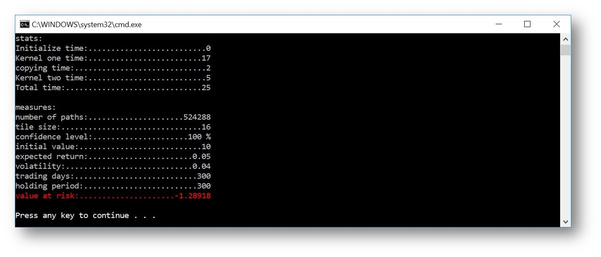

# MC Sim
This Visual Studio project is my coursework for ```CMP 202``` at Abertay University, Scotland.

## underlying concept
Using a Value at Risk approach we try to make a statement similar to this:
I am X percent certain there will not be a loss of more than V dollars in the next N days. (Hull, 2012)
So X is the confidence level, where V is the loss and n is the holding period.
```
dS = μ S dt + σ S ds

S = stock price
μ = exp. return
σ = volatility
```
## approach
```
repeat n times
  repeat t times
    generate normal distributed number
    update end price
  save end price to path array  
extract the 0th quantile
print results
```
## boundary
- Assuming a stock without dividend payments
- single stock portfolio
- using C++ AMP
- extents that don't require padding
- optimized for a NVIDIA GeForce 940MX

## dependencies
- Commandline parsing is handled through [TCLAP](http://tclap.sourceforge.net/)
- Concurrency Visualizer Marker through [Visual Studio Extension](https://marketplace.visualstudio.com/items?itemName=Diagnostics.ConcurrencyVisualizer2017)
- Random number generation through [amprng](https://archive.codeplex.com/?p=amprng)

## usage
Using the program is simple:
```
cd path
REM access help for explanation on cl arguments
C:\path>ConsoleApplication3 --help
REM sample usage of calculation with a tile size of 16 and 512k paths
C:\path>ConsoleApplication3 -x 16 -p 524288 -i 10 -r 0.05 -v 0.04 -d 300 -t 300
```
sample output:


## Todos
- [x] Prepare proposal
- [x] Implement MC kernel
- [x] Implement path array to value at risk functionality
- [x] Optimize memory access, ~~loop unrolling~~ etc.
- [x] measure performance
- [x] Prepare presentation
- [ ] Enhance to a multi stock portfolio (optional)
- [ ] Download historical data from quandl (optional)
- [ ] Calculate volatility using EWMA method (optional)
## Contact
Feel free to send me a  [mail](mailto:1705042@abertay.ac.uk)
